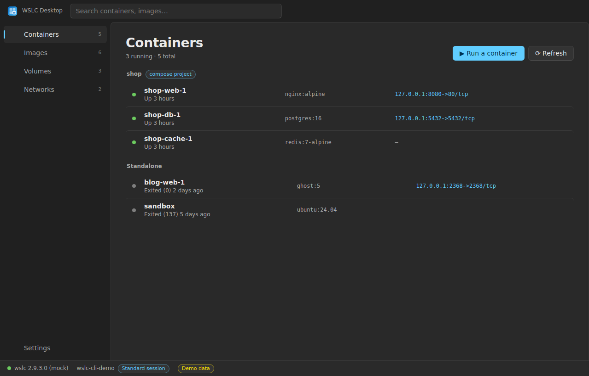

# WSLC Desktop

[](https://github.com/bacarndiaye/wslc-desktop/actions/workflows/ci.yml)
[](LICENSE)

**A simple, fluid desktop app for [WSL containers (wslc)](https://learn.microsoft.com/windows/wsl/wsl-container) — what Docker Desktop does, the Windows way.**

Microsoft's WSL container preview ships `wslc`, a CLI that runs containers natively on
Windows — but no graphical client. WSLC Desktop fills that gap: a native-feeling
Windows 11 app (Fluent design, Mica, Segoe UI) to see and control everything wslc runs.



> Sister project: [wslc-compose](https://github.com/bacarndiaye/wslc-compose) brings
> `docker-compose.yml` support to wslc. WSLC Desktop recognizes its containers and
> groups them by compose project.

## Features

- **Containers** — live list with status, image and published ports; start / stop /
  restart / remove; one click to open a published port in the browser or an
  interactive shell in Windows Terminal; live **logs**; full **inspect**.
  Containers managed by wslc-compose are grouped under their project.
- **Images** — list, pull from any registry, remove, run with a quick dialog
  (name, ports, volumes, environment).
- **Volumes & networks** — list, create, remove.
- **Session bar** — the app's signature: always shows which wslc **session** you are
  in (per-user *and per-elevation* in the preview), flags Administrator sessions, and
  turns wslc's cryptic preview errors (mount limit, wedged session) into plain
  guidance.
- **Windows-native look** — Fluent design tokens, Mica window material, Segoe UI
  Variable / Cascadia Mono, light & dark theme following Windows.
- **No daemon, no telemetry** — the app is a thin shell over `wslc.exe`; nothing runs
  when it's closed, nothing leaves your machine.

## Install

Download the latest `WSLC Desktop-Setup-*.exe` from the
[Releases page](https://github.com/bacarndiaye/wslc-desktop/releases) and run it.
Per-user install, no admin rights needed.

Requirements: Windows 11 with the
[WSL container preview](https://learn.microsoft.com/windows/wsl/wsl-container)
installed (`wslc` must work in a terminal).

> ⚠️ Run WSLC Desktop **from a normal (non-elevated) context**. wslc keeps a separate
> session per elevation level; an elevated app would see different containers than
> your regular terminals. The session bar tells you where you are.

## Troubleshooting

**Lists stay empty with “wslc files are locked by another wslc command still
running” (`ERROR_SHARING_VIOLATION`)** — first check whether it's really the app:
run `wslc list -a` in a regular terminal. If the terminal shows the same error, the
wslc **session store is locked machine-wide** — a preview bug we've hit after storms
of concurrent wslc invocations. No app or terminal can fix it from the outside;
reset the wslc state:

1. Close WSLC Desktop.
2. From PowerShell: `wsl --shutdown`, reopen a terminal, test `wslc list -a`.
3. Still failing? From an **admin** PowerShell: `Restart-Service WslService -Force`
   (this stops all of WSL). If the service hangs in `StopPending`, kill its PID —
   see the [recovery cheat sheet](https://github.com/bacarndiaye/wslc-compose/blob/main/docs/MIGRATION.md#appendix--recovery-cheat-sheet).
4. Restart your containers, then launch WSLC Desktop again.

To avoid triggering this state, WSLC Desktop runs **at most one wslc command at a
time**, retries transient lock errors, and backs off its polling (up to 60 s)
while wslc keeps failing. Version checks can still succeed while lists fail: the
green “wslc x.y.z” dot only means the binary answers, not that the session store
is healthy.

**“Starting the wslc session…” for a long time** — the first wslc call after a
Windows boot starts the session's utility VM; it can take over a minute. The app
keeps retrying and connects by itself.

**Anything else** — *Settings → Run diagnostics* shows the raw output of
`wslc --version`, `wslc system session list` and `wslc list -a` (direct and through
`cmd.exe`), with exit codes and timings. Paste that output in your
[issue](https://github.com/bacarndiaye/wslc-desktop/issues).

## Code signing policy

Free code signing provided by [SignPath.io](https://signpath.io), certificate by
[SignPath Foundation](https://signpath.org).

- Releases are built exclusively by [GitHub Actions](.github/workflows/release.yml)
  from the source in this repository, and only tagged releases are signed.
- Committers and reviewers: [Bacar Ndiaye](https://github.com/bacarndiaye) (project
  maintainer). Approvers: the maintainer approves every signing request.
- Until the SignPath application is approved, installers are unsigned and Windows
  SmartScreen shows an "unknown publisher" notice: choose *More info → Run anyway*.

**Privacy statement**: WSLC Desktop does not transfer any information to other
networked systems. It only invokes the local `wslc.exe` CLI; the only network
activity is the one you request explicitly (pulling images through wslc).
Full policy: [Privacy Policy](https://bacarndiaye.github.io/wslc-desktop/privacy.html).

## Development

```console
git clone https://github.com/bacarndiaye/wslc-desktop
cd wslc-desktop
npm install
npm start            # against the real wslc
npm run start:mock   # full UI with demo data, no wslc needed
npm test             # unit tests for the wslc output parsing
npm run dist         # build the Windows installer (needs Windows or CI)
```

Architecture — deliberately small, no framework:

```
electron/main.js     window (Mica, custom titlebar), IPC, settings
electron/preload.js  the only bridge between UI and system (contextIsolation)
electron/wslc.js     every wslc call: JSON-first parsing with plain-text
                     fallback, timeouts everywhere, friendly error mapping
electron/mock.js     simulated backend for development and demos
app/                 the renderer: vanilla JS + CSS, Fluent design tokens
```

The UI never touches the system directly: every action goes through
`preload.js` → IPC → `wslc.js`, which shells out to `wslc.exe` with a timeout so a
wedged preview session shows an error instead of freezing the app.

## Known wslc preview limitations surfaced in the app

- Sessions are per Windows user **and elevation level** — the session bar shows
  which one you're in and warns on Administrator sessions.
- ~15 bind mounts per session; the error is translated into the fix
  (`wsl --shutdown`).
- No restart policies or healthchecks in wslc yet; restart is emulated (stop + start).

## License

[MIT](LICENSE) © Bacar Ndiaye — not affiliated with Microsoft.
